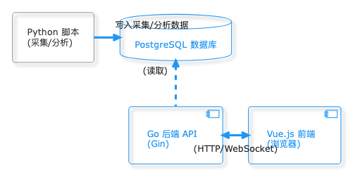

# Etrade

<div align=center>
   
   
   
</div>

## 简介

### 功能

Etrade 是一个用于 CEX-DEX 套利分析的一站式平台，主要针对 Uniswap V3 和 Binance 的 ETH/USDT 交易对进行分析。

当前版本的核心数据流/调用链路如下：

`[Vue.js 前端 (浏览器)] -> [Go 后端 API (Gin)] -> [Python Worker (gRPC，采集/分析)] -> [PostgreSQL 数据库]`

其中：Go 端负责任务创建/调度与对外 API；Python 端作为 Worker 执行具体脚本（采集/聚合/分析）并写入任务日志与结果。



### 技术栈

使用技术栈为：
- PostgreSQL: 存储套利机会、交易记录、任务日志、批次/模板等数据
- Go (Gin): 请求处理、任务调度、Swagger 文档
- Python: 数据获取与分析（gRPC Worker + pandas/psycopg2）
- Vue: 前端看板（ant-design-vue / echarts）
- gRPC/Protobuf: 后端与 Worker 的任务派发接口

## 快速开始

### 前端

```bash
# 在 frontend 目录
npm install # 下载对应依赖
npm run dev # 运行项目
```

前端默认请求后端 `http://localhost:8888/api/v1`（如需修改请使用前端环境变量配置）。

前端项目结构，主要是 src 目录：

- api：接口，和后端对应，使用 `axios` 库
- assets：一些公用的 css 等资源
- components：可复用的组件
- router：动态路由组件
- views：vue页面
- app.vue/main.tx/style.css：一些全局配置
- views：vue 页面
- app.vue/main.ts/style.css：一些全局配置

可能会在 `tsconfig.app.json` 这类配置文件里面出现一些很奇怪的报错，如果经检查确实没什么问题，很有可能是因为缓存机制，把报错的语句/文件删除了再恢复一般就正常了，实在有无法修复的奇怪报错可以忽略。

### postgresql

可以使用docker拉取
使用 docker 拉取，便于调整端口等配置。这里 postgresql 运行的端口用默认的 5432 端口（请确保这个端口可用，或者换到别的可用端口），默认用户名为 postgres，密码就是 123456，这个账号和密码用于访问数据库本身。

```bash
# 拉取 PostgreSQL
docker pull postgres
# 运行，配置尽量不要改
docker run --name postgresql \
  -e POSTGRES_PASSWORD=123456 \
  -p 5432:5432 \
  -d postgres
```

PgAdmin（用于管理PostgreSQL）同样可以使用docker拉取，注意数据库的ip地址需要使用`host.docker.internal`
PgAdmin 用于查询和管理 PostgreSQL，同样可以使用 docker 拉取，下面的邮箱 `test@123.com` 和密码是用于访问 PgAdmin，但注意 PgAdmin 中输入 docker 部署的本地服务器 ip 地址时需要使用 `host.docker.internal`，而不是 `localhost` 或者 `127.0.0.1`。

```bash
# 一并拉取 pgadmin4 方便查询
docker pull dpage/pgadmin4

docker run -d -p 5433:80 \
  --name pgadmin4 \
  -e PGADMIN_DEFAULT_EMAIL=test@123.com \
  -e PGADMIN_DEFAULT_PASSWORD=123456 \
  dpage/pgadmin4
```

### RabitMQ

使用docker安装

```bash
docker run -d \
  --name rabbitmq \
  -p 5672:5672 \
  -p 15672:15672 \
  -e RABBITMQ_DEFAULT_USER=admin \
  -e RABBITMQ_DEFAULT_PASS=123456 \
  rabbitmq:management
```

### 后端

运行后端：

```bash
# 在 backend 目录
go mod tidy # 自动处理依赖关系
go run main.go # 运行项目，端口 8888
```

需要配置好`config/config.yaml`下的数据库连接信息
并配置好：
- `backend/config/config.yaml`：数据库连接 + `worker.address`（Python Worker 地址）

Swagger 地址：`http://localhost:8888/swagger/index.html`

项目结构，MVC 模式：
- api：用于收发 http 请求
- db：数据库配置
- models：模型，用于数据库存储和出入参
- service：业务逻辑，可以与数据库交互/派发 Worker 任务
- utils：一些工具方法

`utils/response.go`中定义了统一的后端返回方法，直接在api层调用这些方法返回即可，统一的格式为：
需要注意 `utils/response.go` 中定义了统一的后端返回方法，只需要直接在 api 层调用这些方法返回就行了，统一的格式为：

```json
{
    "code": 200,
    "message": "",
    "data": []
}
```

比如要返回一个失败的请求，就可以：

```go
utils.Fail(c, http.StatusInternalServerError, err.Error())
```

models 中的结构体注释建议都写，因为这个项目中理论上正常的数据每一项都是非空的，比如：

```go
type BinanceTrade struct {
	ID        uint      `gorm:"primaryKey"`
	TradeTime time.Time `gorm:"index;not null"`
	Price     float64   `gorm:"not null"`
	Quantity  float64   `gorm:"not null"`
}
```

> 风险分析更新 (Risk Analysis Update)
> 我们在 `arbitrage_opportunities` 表中新增了 **`risk_metrics_json`** (JSONB) 字段。
> 现在每次运行 `analyse` 任务时，除了计算利润，还会自动调用 Python 端的风险模型，计算包括 **滑点 (Slippage)**、**波动率 (Volatility)** 和 **风险评分 (Risk Score)** 等指标，并存入该字段。

### data 分析引擎（Python Worker）

```bash
cd data
pip install -r requirements.txt
python server.py
```

`data/server.py` 是 gRPC Worker：后端通过 `worker.address` 调用它执行采集/聚合/分析任务。

## 系统部署指南

### 1. 依赖准备

- 操作系统：推荐 Linux 或 Windows（PowerShell）
- PostgreSQL：用于存储套利任务、批次、机会等数据（默认端口 5432）
- Go 1.20+：运行后端 API
- Python 3.10+：运行数据脚本/worker（建议使用虚拟环境 `.venv`）
- Node.js 18+：运行前端

环境变量建议：

```bash
# 在仓库根目录
python -m venv .venv
./.venv/Scripts/activate  # Windows 上运行
pip install -r data/requirements.txt

cd backend && go mod tidy
cd ../frontend && npm install
```

### 2. 数据库初始化

1. 在 PostgreSQL 中创建数据库 `etrade`（或在 `backend/config/config.yaml` 中自定义）。
2. 运行后端（见下）会自动执行 GORM 的 AutoMigrate，创建 `tasks/batches/arbitrage_opportunities` 等表。
3. 如需导入初始数据，可手动执行 SQL 或运行 `data/block_chain/collect_*` 脚本。

### 3. gRPC 代码生成（仅在修改 `protos/task.proto` 后需要）

仓库已包含生成后的 Python/Go 代码；如果你修改了 `protos/task.proto`，可按下面方式重新生成 Python 端代码：

```bash
pip install grpcio-tools
cd data
python -m grpc_tools.protoc -I .. --python_out=. --grpc_python_out=. ../protos/task.proto
```

生成文件会落在 `data/protos/` 下（对应 `from protos.task_pb2 import ...` 的导入路径）。

### 4. 数据脚本 Worker（Python）

Python 端负责实际执行任务（采集/分析）并写入日志：

```bash
cd data
# 启动 worker（默认读取 data/config/config.yaml，监听 worker_port=50052）
python server.py
```

`data/server.py` 会：
1. 监听 gRPC RPC（CollectBinance/CollectUniswap/ProcessPrices/Analyse）。
2. 读取 `data/config/config.yaml` 中的 DB 配置，写入 `task_logs` 并更新 `tasks.status`。
3. 调用 `data/block_chain/*.py` 执行具体任务。

### 5. Go 后端

后端同时暴露 HTTP (默认 `:8888`) 和内部 gRPC (默认 `:50060`)：

```bash
cd backend
go run main.go
```

- `backend/config/config.yaml` 的 `worker.address` 指定 Python Worker 地址（如 `127.0.0.1:50052`）。
- HTTP API 对外服务 `/api/v1/*`，Swagger 地址 `http://localhost:8888/swagger/index.html`。

### 6. 前端

```bash
cd frontend
npm install
npm run dev        # 开发模式
# 或 npm run build && npm run preview
```

### 7. 常见问题

- **任务一直 RUNNING**：确认 Python Worker 已启动，且后端 `worker.address` 指向正确端口；检查数据库 `task_logs` 是否有日志，若无则 Worker 未执行。
- **端口冲突**：Go HTTP `:8888`，Go gRPC `:50060`，Python Worker `:50052`。确保三者不冲突。
- **proto 导入失败**：确认 `data/protos/task_pb2.py` 与 `data/protos/task_pb2_grpc.py` 存在；建议从 `data/` 目录启动 Worker。

按以上步骤即可启动完整系统：先启动 PostgreSQL → Python Worker → Go 后端 → 前端；然后访问前端面板或 REST API，即可使用套利分析平台。

## 许可证

本项目采用 MIT License，详见仓库根目录 `LICENSE`。
